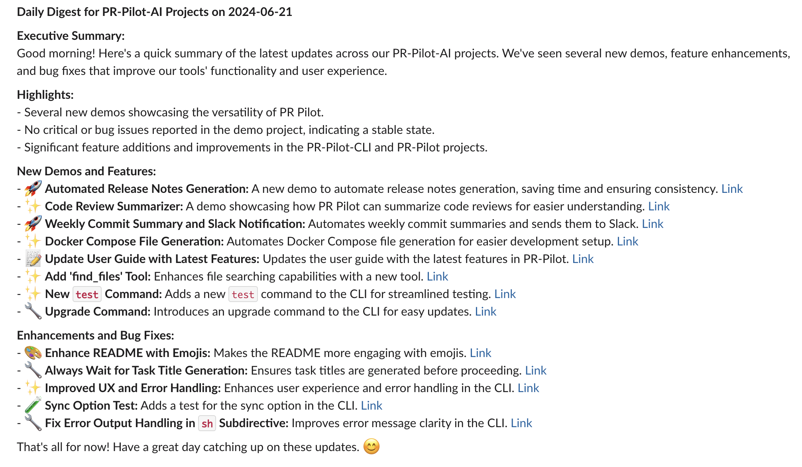

# 📊 Daily Reports for Github Repositories

Every developer has their routine in the morning:
- 🐛 See if there's any new issues on Github
- 🔍 Get an overview of currently unresolved bug tickets
- 📊 Check the status of ongoing development efforts
- etc

With PR Pilot, you can automate the process of collecting and summarizing this information, creating a daily report that you can read in the morning to catch up on what happened yesterday.

## 🛠️ How it works

Running [run.sh](run.sh) will:

1. **📥 Collect Information**: PR Pilot gathers data from Github and other tools to summarize the day's activities from a list of Github repos
2. **📝 Generate Report**: Using a template, PR Pilot organizes the information into a structured report.
3. **💾 Deliver Report**: The report is saved as a Markdown file in `daily-reports/<OWNER>/<REPO>/<DATE>.md`

### 🤖 Automation

Instead of running the script manually, you can run it as a [Github Action to generate daily reports](../.github/workflows/daily-report.yml) for your team.

## 📄 Example Output

Running the script might look something like this:

```bash
Generating report for PR-Pilot-AI/demo
✔ Task created: 1c8d1b65-30a8-45b6-b737-38ac56306984 (0:00:00.00)
✔ Result saved in PR-Pilot-AI/demo/2024-06-20.md (0:00:13.58)
Generating report for PR-Pilot-AI/pr-pilot
✔ Task created: 13c51b00-5e06-4ab7-af60-e62158e7d4c7 (0:00:00.00)
✔ Result saved in PR-Pilot-AI/pr-pilot/2024-06-20.md (0:00:19.90)
Generating report for PR-Pilot-AI/pr-pilot-cli
✔ Task created: 2601efa5-07b8-4de4-b972-8fc49f29a80c (0:00:00.00)
✔ Result saved in PR-Pilot-AI/pr-pilot-cli/2024-06-20.md (0:00:22.01)
```

We're generating reports daily in the [PR-Pilot-AI](PR-Pilot-AI) folder for you
so you can see what it looks like for some of our repositories:
- [PR Pilot Agent](PR-Pilot-AI/pr-pilot-cli)
- [PR Pilot Demos Repository](PR-Pilot-AI/demo)
- [PR Pilot Command-Line Interface](PR-Pilot-AI/pr-pilot)

### Icing on the Cake: Daily Slack Digest
You can take this approach to the next level by combining all the daily reports into a single daily digest and posting it to a specific channel. 
This way, your team can catch up on everything that happened yesterday in one place.

Here is what that looks like on Slack:



## 🎨 Make it your own
This example is just a starting point. You can **customize the report template and the information collected** to suit your needs.

Some ideas that might inspire you:
- 📬 Add instructions to **summarize new Slack messages** from a specific channel
- ✅ Include a section on **recently closed issues** to highlight progress
- 📢 **Post the report to #daily-reports on Slack** for easy access
- 🔍 Add instructions to find **new Linear issues** created by your team