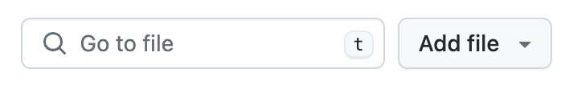

# 📸 Screenshot to Code

When developing frontend applications, developers often need to convert a design mockup into code. This process can be time-consuming and error-prone, especially when the design is complex. In this demo, we will show how to use PR Pilot to convert a screenshot of a design mockup into HTML and CSS code.

```shell
# Generate REACT component based on screenshot content
pilot --no-sync --verbose task --code --snap -o component.tsx -f generate-component.md.jinja2
```

## How it Works
Here is what the command does:
1. The `--snap` flag lets you select a portion of the screen to capture.
2. The `--code` flag tells PR Pilot to output only the code, no other text
3. The `-o component.tsx` parameter specifies the output file name.

In the [generate-component.md.jinja2](generate-component.md.jinja2) template, we define
what exactly we'd like to generate - in this case a React component.

## Example

Given the following screenshot:



Running the command above will generate the following React component:

```tsx
import React from 'react';

// Props for the GoToFile component
interface GoToFileProps {
  placeholderText?: string;
  buttonText?: string;
  onButtonClick?: () => void;
}

// Functional component resembling the screenshot
const GoToFile: React.FC<GoToFileProps> = ({
  placeholderText = 'Go to file',
  buttonText = 'Add file',
  onButtonClick,
}) => {
  return (
    <div style={{ display: 'flex', alignItems: 'center', border: '1px solid #d1d5da', borderRadius: '6px', padding: '5px' }}>
      {/* Search input resembling the "Go to file" input box */}
      <input
        type="text"
        placeholder={placeholderText}
        style={{
          border: 'none',
          outline: 'none',
          flex: 1,
          padding: '5px',
          fontSize: '14px',
        }}
      />
      {/* Button resembling the "Add file" button */}
      <button
        onClick={onButtonClick}
        style={{
          backgroundColor: '#f6f8fa',
          border: '1px solid #d1d5da',
          borderRadius: '6px',
          padding: '5px 10px',
          marginLeft: '5px',
          cursor: 'pointer',
          fontSize: '14px',
        }}
      >
        {buttonText}
      </button>
    </div>
  );
};

export default GoToFile;

/*
  This component is designed to resemble the screenshot provided. The screenshot shows a UI element with the following features:
  - A search input box with a placeholder text "Go to file".
  - A button next to the input box with the text "Add file".
  - The button has a dropdown indicator, but for simplicity, this component does not include the dropdown functionality.
  - The overall design includes a border around the input and button, with rounded corners and padding.

  The component accepts the following props:
  - placeholderText: Customizable placeholder text for the input box.
  - buttonText: Customizable text for the button.
  - onButtonClick: Optional click handler for the button.

  The component uses inline styles to closely match the appearance of the elements in the screenshot.
*/
```

## 🛠️ Customization

You can customize the output by modifying the [generate-component.md.jinja2](generate-component.md.jinja2) template. The template uses Jinja2 syntax to define the structure of the generated code. You can modify the template to generate different types of components based on your requirements.
Here are some ideas:

- 🎨 Generate a component with different styles or layout.
- 🔄 Use a different framework like Angular or Vue.js
- 📚 Include instructions for using specific CSS classes or utility libraries.
